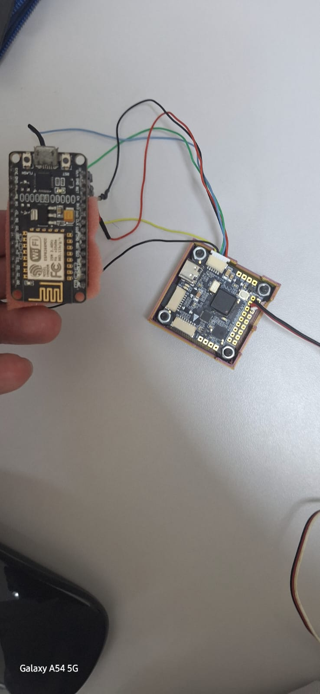
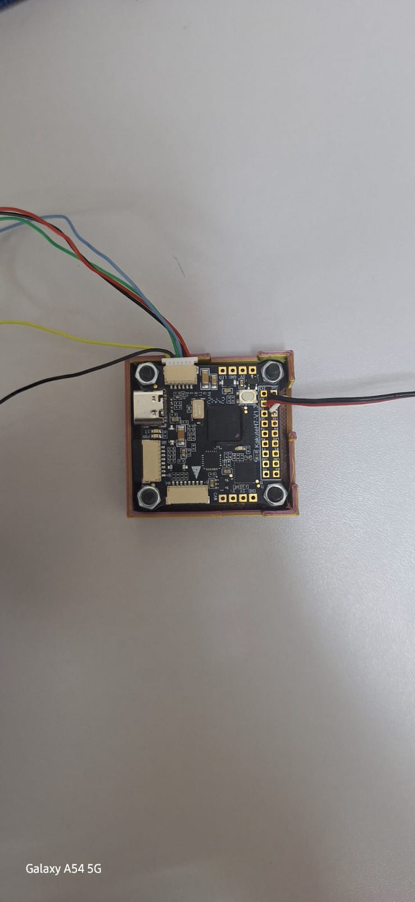
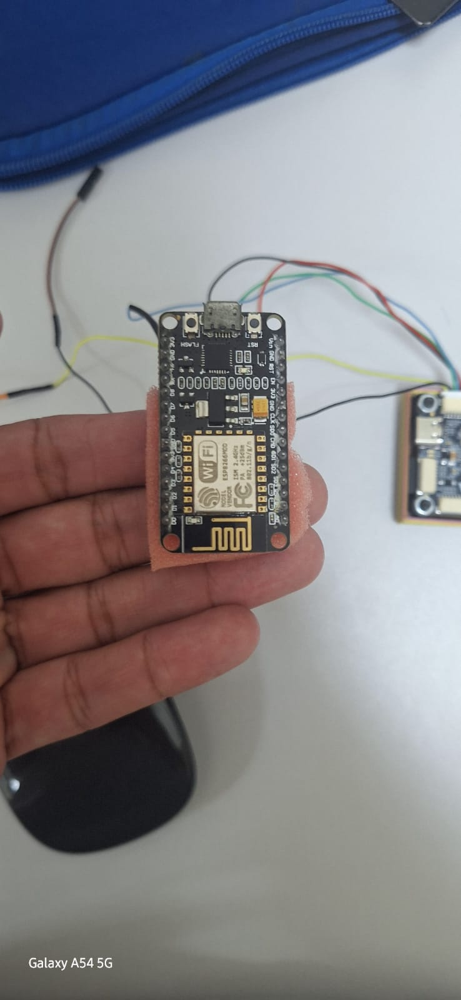
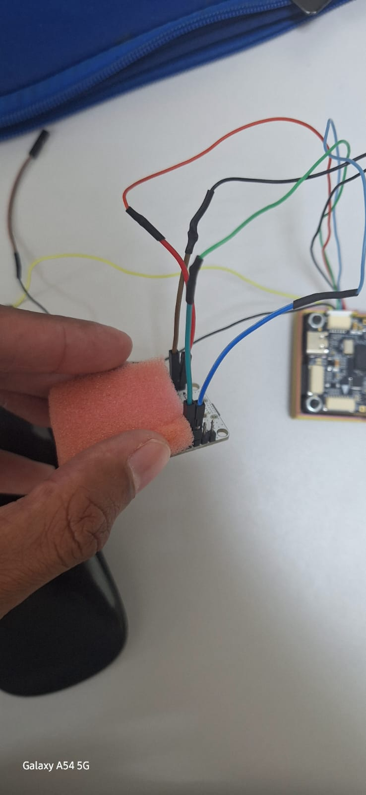

# MavESP8266

# Esp866 Bridge

Este projeto é dedicado a realizar a comunicação da Kakuteh7 com a base em solo , usando como bridge uma esp8266.

j




## Pinos

# Conexões entre Kakute H7 e ESP8266

A tabela a seguir mostra a correspondência de conexões entre a **Kakute H7** e o **ESP8266**:

| **Kakute H7** | **ESP8266** | **Descrição**                                         |
|---------------|--------------|-------------------------------------------------------|
| `R1` (UART RX) | `TX`         | Recebe dados do ESP (Transmissão do ESP)             |
| `T1` (UART TX) | `RX`         | Envia dados para o ESP (Recepção do ESP)             |
| `Vin`          | `9V` (fonte) | Entrada de alimentação do Kakute H7                  |
| `GND`          | `GND`        | Terra comum (referência elétrica entre os dispositivos) |

## Observações Importantes
- **Pinos**:
- Os pinos mencionados na tabela são os pinos de telemetria

- **Alimentação**:
  - A Kakute H7 geralmente opera com **5V**, mas pode aceitar até **9V–12V** no pino `Vin`.
  - O **ESP8266 NÃO deve ser alimentado com 5V ou 9V diretamente**. Ele precisa de **3.3V** no pino `VCC`.
  - Portanto, **NÃO conecte a Vin da Kakute diretamente ao ESP8266**. Utilize um **regulador de tensão 3.3V** ou um **conversor step-down adequado**.
  - o esp8266 possui conversor de tensão , caso a placa seja trocada , deve ser verificado na datashet susa respectivas caracteristicas.

- **Níveis de Sinal (RX/TX)**:
  - A Kakute H7 e o ESP8266 operam com sinais de **3.3V**, o que permite comunicação UART **direta e segura** entre os dois sem necessidade de conversores de nível lógico.

- **UARTs**:
  - As portas `R1` e `T1` da Kakute H7 correspondem à UART1.
  - Verifique a UART utilizada no seu firmware (como Betaflight ou INAV) para garantir a correta comunicação.


## Ponto de Acesso WiFi ESP8266 e Bridge MavLink

[](https://gitter.im/dogmaphobic/mavesp8266?utm_source=badge&utm_medium=badge&utm_campaign=pr-badge&utm_content=badge)

Este projeto foi desenvolvido usando um [NodeMCU v2 Dev Kit](http://www.seeedstudio.com/depot/NodeMCU-v2-Lua-based-ESP8266-development-kit-p-2415.html), pois ele fornece convenientemente uma UART secundária para depuração. Ele também foi testado com o ESP-01 que acompanha o [PixRacer](https://pixhawk.org/modules/pixracer) e se mostrou estável a uma taxa de 921600 baud.

O ambiente de desenvolvimento é baseado no [PlatformIO](http://platformio.org). Siga as instruções disponíveis aqui: http://platformio.org/#!/get-started (testado apenas no Mac OS) para instalá-lo, mas **pule o passo `platform init`**, pois isso já foi feito, modificado e está incluído neste repositório. Em resumo:


brew install platformio
git clone --recursive https://github.com/dogmaphobic/mavesp8266.git
cd mavesp8266
platformio run


Ao executar o comando ```platformio run``` pela primeira vez, o sistema irá baixar automaticamente as toolchains e todas as bibliotecas necessárias.

### Comandos úteis:

- ```platformio run``` — processa/compila todos os alvos
- ```platformio run -e esp12e``` — processa/compila apenas o alvo ESP12e (como o NodeMCU v2, Adafruit HUZZAH, etc.)
- ```platformio run -e esp12e -t upload``` — compila e faz upload do firmware para a placa embarcada
- ```platformio run -t clean``` — limpa o projeto (remove os arquivos compilados)

A(s) imagem(ns) resultante(s) podem ser encontradas no diretório ```.pioenvs```, criado durante o processo de compilação.

